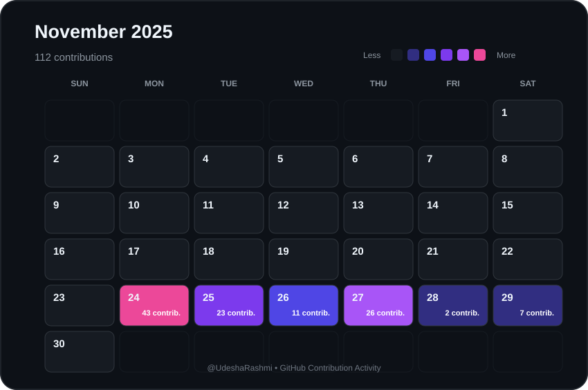

# 📅 November 2025 Contributions

  

  <a href="./2025-10.md">⬅ October 2025</a>
  &nbsp;&nbsp;&nbsp; | &nbsp;&nbsp;&nbsp;
  <a href="./README.md">📅 All Months</a>
  &nbsp;&nbsp;&nbsp; | &nbsp;&nbsp;&nbsp;
  <a href="./2025-12.md">December 2025 ➡</a>

  <strong>
    112 contributions during November 2025
  </strong>

---

  Automatically generated from GitHub contribution data.

