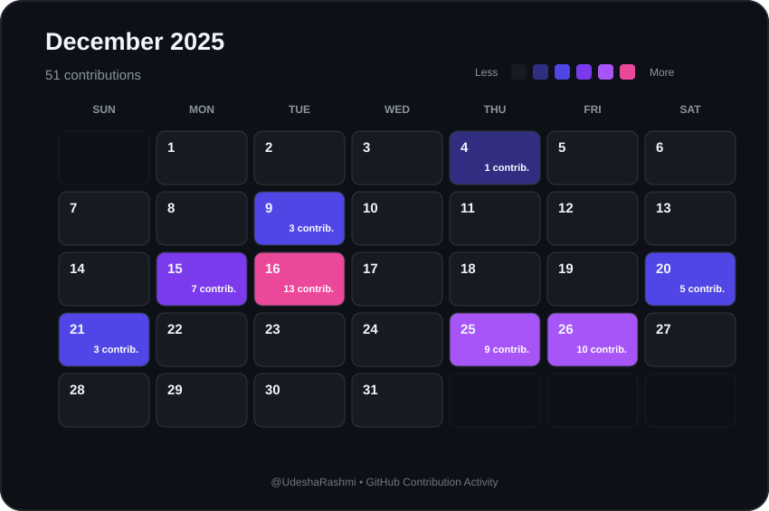

# 📅 December 2025 Contributions

  

  <a href="./2025-11.md">⬅ November 2025</a>
  &nbsp;&nbsp;&nbsp; | &nbsp;&nbsp;&nbsp;
  <a href="./README.md">📅 All Months</a>
  &nbsp;&nbsp;&nbsp; | &nbsp;&nbsp;&nbsp;
  <a href="./2026-01.md">January 2026 ➡</a>

  <strong>51 contributions during December 2025</strong>

---

  Automatically generated from GitHub contribution data.

