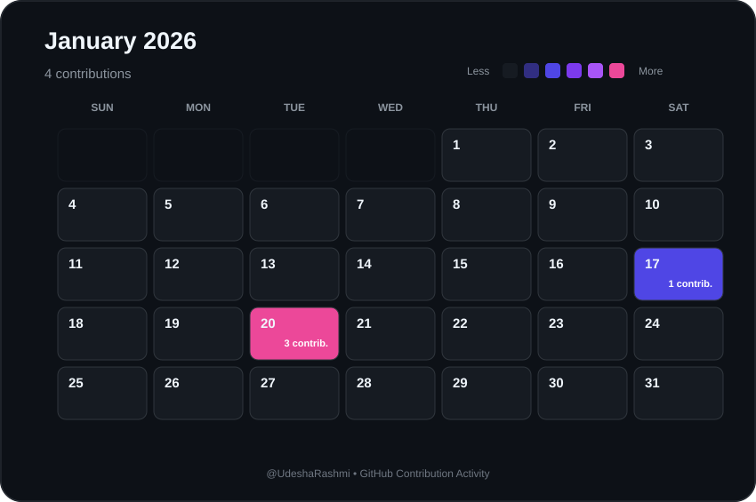

# 📅 January 2026 Contributions

  

  <a href="./2025-12.md">⬅ December 2025</a>
  &nbsp;&nbsp;&nbsp; | &nbsp;&nbsp;&nbsp;
  <a href="./README.md">📅 All Months</a>
  &nbsp;&nbsp;&nbsp; | &nbsp;&nbsp;&nbsp;
  <a href="./2026-02.md">February 2026 ➡</a>

  <strong>
    31 contributions during January 2026
  </strong>

---

  Automatically generated from GitHub contribution data.

