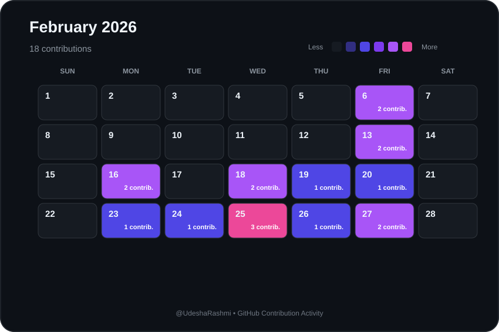

# 📅 February 2026 Contributions

  

  <a href="./2026-01.md">⬅ January 2026</a>
  &nbsp;&nbsp;&nbsp; | &nbsp;&nbsp;&nbsp;
  <a href="./README.md">📅 All Months</a>
  &nbsp;&nbsp;&nbsp; | &nbsp;&nbsp;&nbsp;
  <a href="./2026-03.md">March 2026 ➡</a>

  <strong>18 contributions during February 2026</strong>

---

  Automatically generated from GitHub contribution data.

