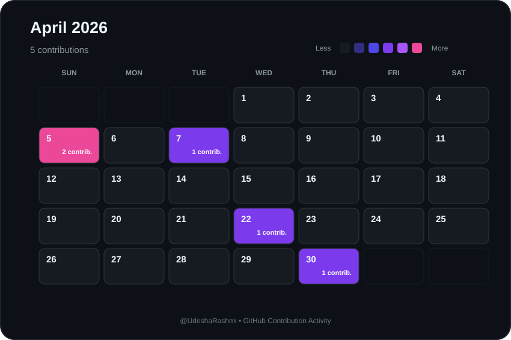

# 📅 April 2026 Contributions

  

  <a href="./2026-03.md">⬅ March 2026</a>
  &nbsp;&nbsp;&nbsp; | &nbsp;&nbsp;&nbsp;
  <a href="./README.md">📅 All Months</a>
  &nbsp;&nbsp;&nbsp; | &nbsp;&nbsp;&nbsp;
  <a href="./2026-05.md">May 2026 ➡</a>

  <strong>
    5 contributions during April 2026
  </strong>

---

  Automatically generated from GitHub contribution data.

