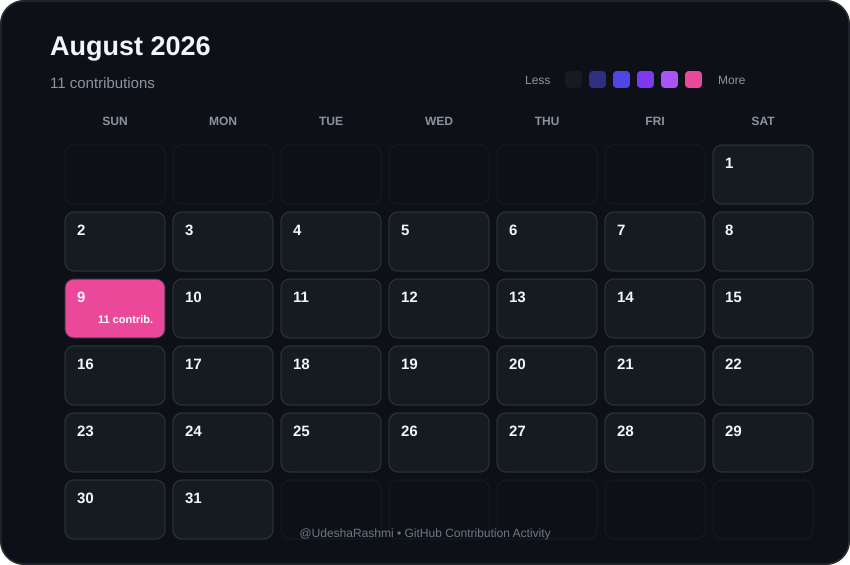

# 📅 August 2026 Contributions

  

  <a href="./2026-07.md">⬅ July 2026</a>
  &nbsp;&nbsp;&nbsp; | &nbsp;&nbsp;&nbsp;
  <a href="./README.md">📅 All Months</a>
  &nbsp;&nbsp;&nbsp; | &nbsp;&nbsp;&nbsp;
  Next ➡

  <strong>
    29 contributions during August 2026
  </strong>

---

  Automatically generated from GitHub contribution data.

